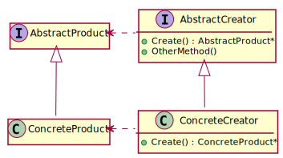

# Design Patterns

## Creational Patterns

### [Abstract Factory](./AbstractFactory/README.md)


### [Builder](./Builder/README.md)


### [Factory Method](./factory_method/README.md)


### [Prototype](./Prototype/README.md)


### [Singleton](./Singleton/README.md)


## Structural Patterns

### [Adapter](./Adapter/README.md)


### [Bridge](./Bridge/README.md)


### [Composite](./Composite/README.md)


### [Decorator](./Decorator/README.md)


### [Facade](./Facade/README.md)


### [Flyweight](./Flyweight/README.md)


### [Proxy](./Proxy/README.md)


## Behavioral Patterns

### [Chain of Responsibility](./ChainOfResponsibility/README.md)


### [Command](./Command/README.md)


### [Interpreter](./Interpreter/README.md)


### [Iterator](./Iterator/README.md)


### [Mediator](./Mediator/README.md)


### [Memento](./Memento/README.md)


### [Observer](./observer/README.md)


### [State](./State/README.md)


### [Strategy](./Strategy/README.md)


### [Template Method](./TemplateMethod/README.md)


### [Visitor](./Visitor/README.md)


## Language Support

### Java

#### `implements` an `interface`

```java
public interface Comparable<T> {
  public abstract int compareTo(T that);
}

public class Point implements Comparable<Point> {
  private final double x;
  private final double y;
  
  public Point(double x, double y) {
    this.x = x;
    this.y = y;
  }
  
  @Override
  public int compareTo(Point that) {
    if (this.x < that.x) return -1;
    if (this.x > that.x) return +1;
    if (this.y < that.y) return -1;
    if (this.y > that.y) return +1;
    return 0;
  }
}
```

#### `extends` a `class`

所有用 `class` 定义的类都是 [`java.lang.Object`](https://docs.oracle.com/javase/8/docs/api/java/lang/Object.html) 的 <子类::subclass> (或 <派生类::derived classs>).

```java
public class Object {
  public String toString();
}

public class Point extends Object {
  private final double x;
  private final double y;
  
  public Point(double x, double y) {
    this.x = x;
    this.y = y;
  }
  
  @Override
  public String toString() {
    StringBuilder sb = new StringBuilder();
    sb.append('(');
    sb.append(this.x);
    sb.append(',').append(' ');
    sb.append(this.y);
    sb.append(')');
    return sb.toString();
  }
  
  // extended methods
  // ...
}
```

### C++

#### Inheritance

```c++
#include <iostream>
#include <string>

class Object {
 public:
  virtual std::string to_string() = 0;
};

class Point : public Object {
 private:
  const double _x;
  const double _y;
  
 public:
  Point(double x, double y) : _x(x), _y(y) { }
  virtual std::string to_string() override {
    return '(' + std::to_string(_x) + ',' + ' ' + std::to_string(_y) + ')';
  }
};

int main() {
  Point p = Point(1.0, 0.0);
  std::cout << p.to_string() << std::endl;
}
```

#### Inheritance + `template`

```cpp
#include <iostream>

template<class T>
class Comparable {
  virtual int compareTo(const T& that) = 0;
};

class Point : public Comparable<Point> {
 private:
  const double _x;
  const double _y;
  
 public:
  Point(double x, double y) : _x(x), _y(y) { }
  virtual int compareTo(const Point& that) override {
    if (_x < that._x) return -1;
    if (_x > that._x) return +1;
    if (_y < that._y) return -1;
    if (_y > that._y) return +1;
    return 0;
  }
};

int main() {
  using P = Point;
  P o = P(0.0, 0.0);
  P p = P(1.0, 0.0);
  std::cout << p.compareTo(o) << std::endl;
}
```
