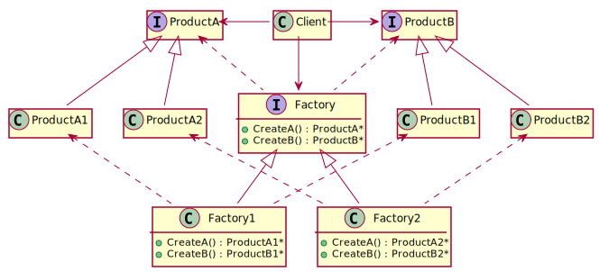

# Abstract Factory (Kit)

## 意图
Provide an interface for creating families of related or dependent objects without specifying their concrete classes.

为创建一族相互关联或依赖的对象提供一个无需指定被创建对象具体类的接口。

## 用途
- 让系统独立于产品的创建、组合、表示。
- 允许系统从多个产品族中任选一族。
- 对一族相关产品的创建和使用施加约束。
- 只提供产品的抽象接口，隐藏其具体实现。

## 类图

## 参与者
- **抽象工厂** (`Factory`)
  - 为每种 **抽象产品** 声明一个创建方法。
- **具体工厂** (`Factory1`, `Factory2`)
  - 实现 **抽象工厂**，每个创建方法返回一种 **具体产品**。
- **抽象产品** (`ProductA`, `ProductB`)
  - 声明产品的抽象接口。
- **具体产品** (`ProductA1`, `ProductA2`, `ProductB1`, `ProductB2`)
  - 实现 **抽象产品**，在 **具体工厂** 中创建并返回。
- **用户** (`Client`)
  - 创建和使用产品，仅使用 **抽象工厂** 和 **抽象产品** 的接口。

## [Java 示例](./Demo.java)

## [C++ 示例](./demo.cpp)
